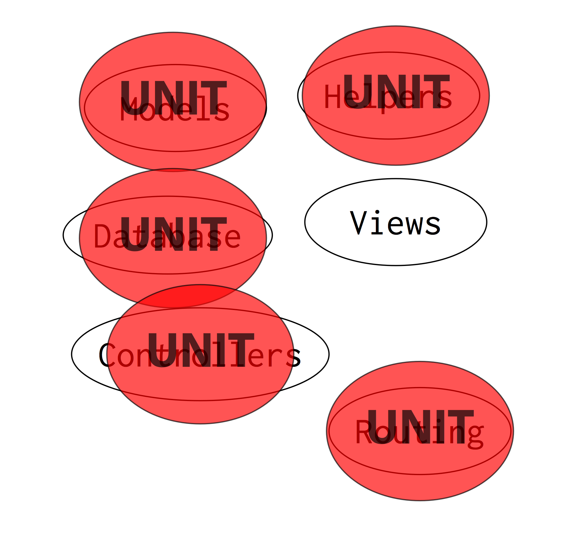
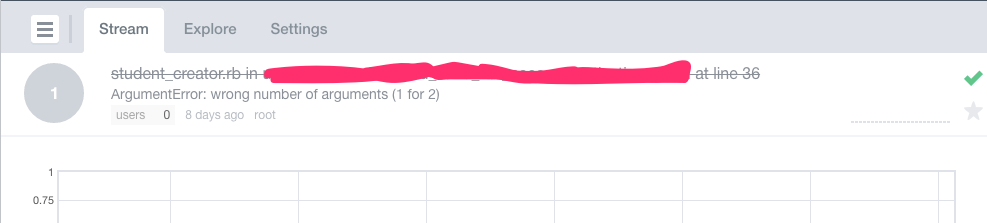

# Bringing Unit Testing and TDD To Rails 

---

# [fit] What's a
# [fit] Unit Test?

---

## Standard Definition

- A test for a single class, or...
- A group of closely-related classes.
- Isolation of the unit from the rest of the codebase.

---

## Rails Definition


- Tests in the "unit" folder.
- Tests for models.
- Tests for minor bits.

---


## Rails

- It's MVC...

---


## Rails

- It's MVC...
- With more stuff

---


## Rails

- It's MVC...
- With more stuff
- Everything touches everything

---


## Rails

- It's MVC...
- With more stuff
- Everything touches everything

### Its Hard to Identify a Unit

---


## Rails

- It's MVC...
- With more stuff
- Everything touches everything

### Its Hard to Identify a Unit
## So the App is the Unit

---


---

## A simple controller

```ruby
class PostsController
  def index
    @posts = Post.all
  end
end
```

---

## A simple test??

```ruby
class PostsControllerTest < ActionController::TestCase
  test "should get index" do
    get :index
    assert_response :success
    assert_not_nil assigns(:posts)
  end
end
```

---

## A simple test??

```ruby
class PostsControllerTest < ActionController::TestCase
  test "should get index" do
    get :index
    assert_response :success
    assert_not_nil assigns(:posts)
  end
end
```

- Makes a GET request
- Asserts a 200 HTTP response
- Asserts *something* was passed to the view as "posts"


---


---

## Things that could break this test

- The route is missing.
- The database table does not exist.
- The view is missing.
- The view has an error.
- A helper used in the view has an error.
- **The data was not passed to the view.**

---


## Rails testing

- Forest-level
- Tests everything at once
- Focus on "Rails Way"

---



## A Different Way

- Tree-level
- Test every unit in isolation
- Focus on Ruby

---


---

## Back to that simple controller

```ruby
class PostsController
  def index
    @posts = Post.all
  end
end
```

---

## A simple test

```ruby
describe PostsController do
  describe "index" do
    it "should pass the pages to the view" do
      posts = Object.new
      Post.stubs(:all).returns posts
      controller.index
      controller.instance_eval { @posts }.must_be_same_as posts
    end
  end
end
```

---


---


---


---


---

## Things that could break this test

- **The data was not passed to the view.**
- And that's it.


---

## Things that could break this test

- **The data was not passed to the view.**

```ruby
describe PostsController do
  describe "index" do
    it "should pass the pages to the view" do
      posts = Object.new
      Post.stubs(:all).returns posts
      controller.index
      controller.instance_eval { @posts }.must_be_same_as posts
    end
  end
end
```

---

###Unit Tests

```ruby
describe PostsController do
```

###Rails Way

```ruby
class PostsControllerTest < ActionController::TestCase
```

##Which One Tests the PostsController ?

---

# What I Advocate Today

Test the code you write.

---

#Let's Get Started

---

# The Missing Link

Include this file and test anything in Rails.

spec_helper.rb

<br>

```ruby
require_relative '../config/environment'
require 'minitest/spec'
require 'minitest/autorun'

```

---

# The Missing Link

Include this file and test anything in Rails... easily.

spec_helper.rb

<br>

```ruby
require_relative '../config/environment'
require 'minitest/spec'
require 'minitest/autorun'
require 'mocha/setup'

```

---

# Minitest

- Comes with Ruby.
- Minimal test framework.
- Break away from common RSpec pitfalls...
- But RSpec works great, too.

---

# Mocha

- Popular mocking framework.
- Allows fast faking/mocking in any object.
- gem install mocha
- (not necessary if you're using RSpec)

---

## Basic Mocha samples

```ruby
car = Object.new
key = Object.new

car.stubs(:start_engine).with(key).returns true

car.expects(:hit_the_brakes)
```

---

# Back to Coding

---

#Common Approaches to Rails Testing

---

## Controllers

- Test the code you write.
- Stub the bits in your controller.
- Abstract out AR work as soon as possible.

---

## Controllers

```ruby
let(:params) { {} }
let(:controller) do
  c = PostsController.new
  c.stubs(:params).returns params
  c
end

it "should look up the post" do
  id = Object.new
  params[:id] = id
  Post.expects(:delete).with(id)
  controller.delete
end
```

---

## Controllers

```ruby

it "should return the post as json" do
  id, post = Object.new, Object.new
  params[:id] = id
  Post.stubs(:find).with(id).returns post
  controller.expects(:render)
            .with(json: { post: post })
  controller.find
end
```
---

## Models

- Test the code you write.
- Don't worry about hitting the database. (!?!?)
- Avoid complicated models, especially with validation and callbacks.
- Lookup the model again before asserting the result.

---

## Models

```ruby

describe "publish a post" do
  it "should set the published_at to now" do
    now = Time.now
    Time.stubs(:now).returns now

    post = Post.create
    post.publish

    post = Post.find post.id
    post.published_at.must_equal now
  end
end
```

---

## Views

- Don't test.
- Dumb views only!!!
- Move all logic into models or decorators.
- ... preferably decorators.

---

## Views

```html
<div>
The address is: 
<%= GoogleMap.create_link( { street: @house.street,
                             city:   @house.city,
                             state:  @house.state,
                             zip:    @house.zip } )
 %>
</div>
```

---

## Views

```html
<div>
The address is: <%= @house.google_link %>
```

<br />

```ruby
# in the controller
@house = HouseDecorator.new @house
```

---

## Views

```ruby
class HouseDecorator
  def initialize house
    @house = house
  end

  def method_missing meth, *args, &blk
    @house.send(meth, *args, &blk)
  end

  def google_link
    GoogleMap.create_link( { street: @house.street,
                             city:   @house.city,
                             state:  @house.state,
                             zip:    @house.zip } )
  end
end
```

---

# Special Techniques

## They don't teach this

---

## Object.new

- Almost everything in Ruby is an Object.
- 1, "darren", Post.new, PostsController.new, nil... all objects.
- We need the fine details less than we think.

---

## Object.new

```ruby
it "should pass the pages to the view" do
  posts = Object.new
  Post.stubs(:all).returns posts
  controller.index
  controller.instance_eval { @posts }.must_be_same_as posts
end
```

---

## Object.new

```ruby
posts = Object.new
Post.stubs(:all).returns posts

#OR

posts = [Post.new, Post.new]
Post.stubs(:all).returns posts

#OR

Post.create(title: 'apple')
Post.create(title: 'orange')
```

---

## Object.new

```ruby
  Post.create(title: 'apple')
  Post.create(title: 'orange')
  controller.index
  posts_returned = controller.instance_eval { @posts }

  posts_returned.count.must_equal 2
  Post.all.each |post|
    posts_returned.include?(post).must_equal 2
  end
```

---

## Object.new

- The more details in a test, the more painful they are.
- Pain in a test is a sign to change our design...
- ... not drop the test.

---

## Object references

```ruby

add(1, 2).must_equal 3

def add a, b
  #following TDD, what goes here?
end
```

---

## Object references

```ruby

add(1, 2).must_equal 3

def add a, b
  3
end

```

---

## Object references

```ruby

add(1, 2).must_equal 3
add(2, 1).must_equal 3
add(3, 4).must_equal 7

def add a, b
  a + b
end

```

---

## Object references

```ruby

post = Object.new
Post.stubs(:find).with(1).returns post
controller.params[:id] = 1

controller.index
controller.instance_eval { @post }.must_be_same_as post

def index
  # what goes here?
end

```

---

## Object references

```ruby

post = Object.new
Post.stubs(:find).with(1).returns post
controller.params[:id] = 1

controller.index
controller.instance_eval { @post }.must_be_same_as post

def index
  Post.find 1
end

```

---

## Object references

```ruby

id = Object.new
post = Object.new
Post.stubs(:find).with(id).returns post
controller.params[:id] = id

controller.index
controller.instance_eval { @post }.must_be_same_as post

def index
  Post.find params[:id]
end

```

---

## Object references

- Checking for a specific object can make more sense
- We can maintain full TDD practice without much more work

---

## Looping tests

```ruby

describe "add" do
  it "should return 3 for 1+2" do
    add(1, 2).must_equal 3
  end

  it "should return 5 for 3+2" do
    add(3, 2).must_equal 5
  end
end

```

---

## Looping tests

```ruby

[
  [3, 1, 2],
  [5, 3, 2],
].each do |example|

  describe "add" do
    it "should return #{example[0]} for #{example[1]}+#{example[2]}" do
      add(example[1], example[2]).must_equal example[3]
    end
  end

end

```

---

## Struct

- The simplest way to get a data object

---

## Struct

```ruby
person = Struct.new(:id, :name).new(4, 'darren')
```

versus

```ruby
person = Person.new # trick question here
person.id   = 4
person.name = 'darren'
```

---

## Struct

```ruby

[
  [3, 1, 2],
  [5, 3, 2],
].map { |x| Struct.new(:result, :a, :b).new *x }.each do |example|

  describe "add" do
    it "should return #{example.result} for #{example.a}+#{example.b}" do
      add(example.a, example.b).must_equal example.result
    end
  end

end

```

---

# But Is Unit Testing Enough?

## Of course not

---

##Costs to this form of development

- Easy to lose the forest-level view.
- Fake-it-till-you-make-it... sometimes you'll forget to make it.
- The real objects may behave differently than your fakes.

---

# Methods to mitigate unit-test-heavy Rails development

---

## Integration Testing

- It's fine, but never at the expense of the unit tests.
- Test the "happy path."
- Keep them light as a feather.

<br />

- In my opinion, never through the view.

---

## Eyeball Testing

- A human must walk through every process and change.
- Hit the web page yourself.
- Sometimes "Refresh" is more cost-effective than integration tests.

---

## Error Tracking

- All errors on a site should be tracked by an external service.
- Notifications should be sent to developers.

---

## Architecture Changes

- Apps should be built to be fault-tolerant.
- Move work to the background as quickly as possible.
- Replayable jobs.
- If an error occurs, replay.
- Sidekiq.

---



---

## Object Structure

- Single Responsibility Principle.
- Simple behaviors.
- No surprises.
- Keep pushing details down till they vanish.

---

## Protect Yourself

- Isolate your app from Rails.
- First 80% of Rails functionality is low-cost/high-return.
- The last 20% is high-cost/low-return.
- Take what it gives you, then program it yourself.

---

# In Summary

---

## A Neat Thing About Extreme Views:
## They Stretch Our Thinking

---

## TDD to the Extreme

- I've offered an extreme position on TDD, Unit-Testing, and Rails.
- I don't expect you to accept it.
- *Some Rails devs think I'm nuts.*

---

## My Hope

- Get you thinking.
- Tell you that it can work, and it does work.
- I never want to hear "**How do I test that in Rails?**" again.

---

## Darren Cauthon
## @darrencauthon
## github.com/darrencauthon

